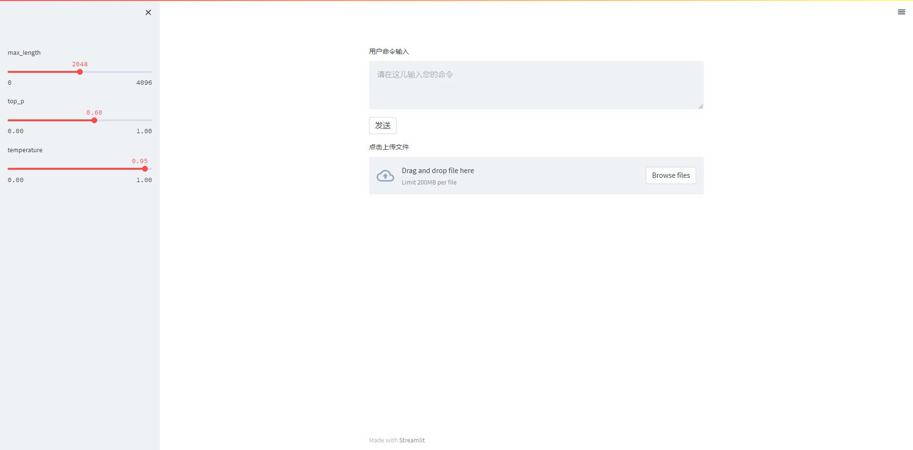

## QA-LocalKnowledge-ChatGLM
- 基于本地知识的ChatGLM问答。
- 该项目的思路是由[langchain-ChatGLM](https://github.com/imClumsyPanda/langchain-ChatGLM)而来。之前使用过这个项目，感觉不是太灵活，部署不太友好，所以想着做这个项目。


#### 使用步骤
1. 安装环境
   ```bash
   pip install -r requirements.txt
   ```
2. 下载模型
   - ChatGLM-6b-int: [HuggingFace](https://huggingface.co/THUDM/chatglm-6b-int4)
   - text2vec-base-chinese: [HuggingFace](https://huggingface.co/shibing624/text2vec-base-chinese)
   - 模型下载好之后，放到`models`目录下即可
3. 运行
    ```bash
    streamlit run webui.py --server.port 8888
    ```
4. 查看效果
    <div align="center">
    
    </div>