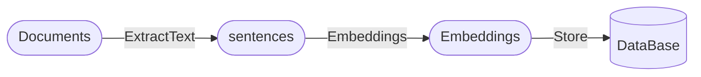
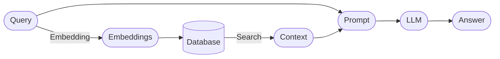

### Parse the document and store it in the database

### Retrieve and answer questions

### Tools Used
- Document analysis: [`extract_office_content`](https://github.com/SWHL/ExtractOfficeContent), [`rapidocr_pdf`](https://github.com/RapidAI/RapidOCRPDF), [`rapidocr_onnxruntime`](https://github.com/RapidAI/RapidOCR)
- Extract feature vector: [`moka-ai/m3e-small`](https://huggingface.co/moka-ai/m3e-base)
- Vector storage: `sqlite`
- Vector retrieval: [`faiss`](https://github.com/facebookresearch/faiss)
- UI: [`streamlit>=1.25.0`](https://github.com/streamlit/streamlit)
