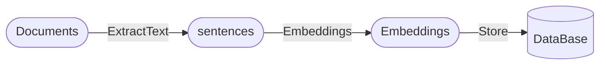
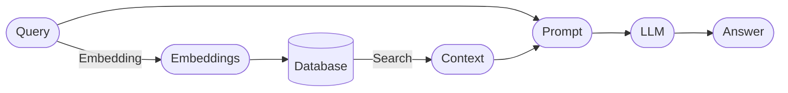

    
&nbsp;

    

        <b><i>🧐 Knowledge QA LLM</i></b>
    

    
&nbsp;

     <a href="">=3.8,<3.12-aff.svg"></a>
     
     
     
     
     
     

### Introduction
- Questions & Answers based on local knowledge base + LLM.
- Reason:
    - The idea of this project comes from [Langchain-Chatchat](https://github.com/chatchat-space/Langchain-Chatchat)
    - I have used this project before, but it is not very flexible and deployment is not very friendly.
    - Learn from the ideas in [How to build a knowledge question answering system with a large language model](https://mp.weixin.qq.com/s/movaNCWjJGBaes6KxhpYpg), and try to use this as a practice.
- Advantage:
    - The whole project is modularized and does not depend on the `lanchain` library, each part can be easily replaced, and the code is simple and easy to understand.
    - In addition to the large language model interface that needs to be deployed separately, other parts can use CPU.
    - Support documents in common formats, including `txt, md, pdf, docx, pptx, excel` etc. Of course, other types of documents can also be customized and supported.

### 📣 We're looking for front-end development engineers interested in Knowledge QA with LLM, who can help us achieve front-end and back-end separation with our current implementation.

### Architecture
#### Parse the document and store it in the database

#### Retrieve and answer questions

#### Tools Used
- Document analysis: [`extract_office_content`](https://github.com/SWHL/ExtractOfficeContent), [`rapidocr_pdf`](https://github.com/RapidAI/RapidOCRPDF), [`rapidocr_onnxruntime`](https://github.com/RapidAI/RapidOCR)
- Extract feature vector: [`moka-ai/m3e-small`](https://huggingface.co/moka-ai/m3e-base)
- Vector storage: `sqlite`
- Vector retrieval: [`faiss`](https://github.com/facebookresearch/faiss)
- UI: [`streamlit>=1.25.0`](https://github.com/streamlit/streamlit)
